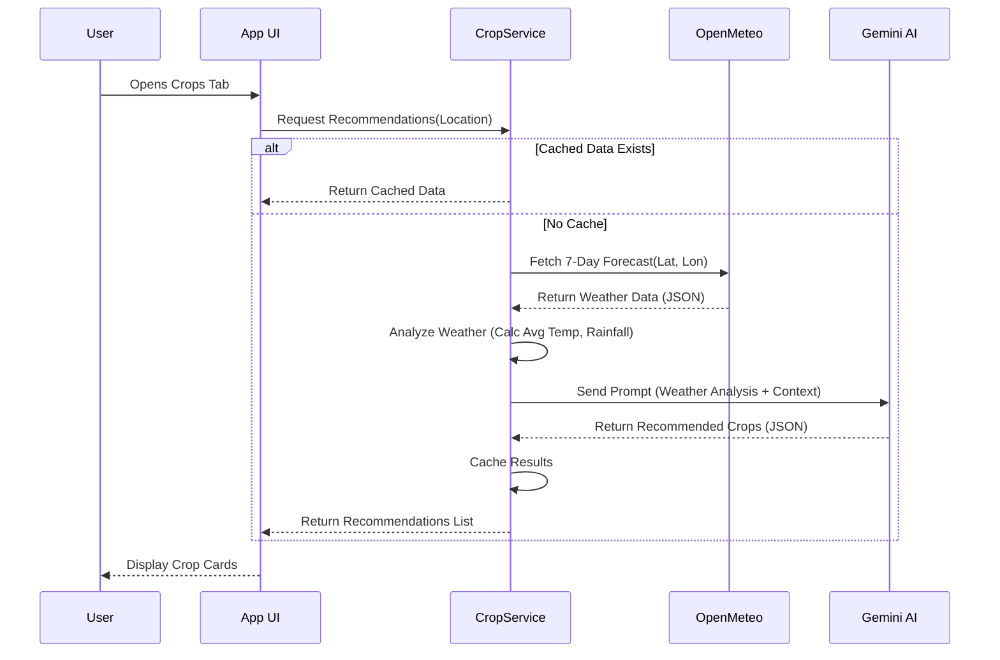
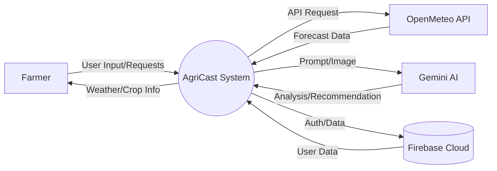
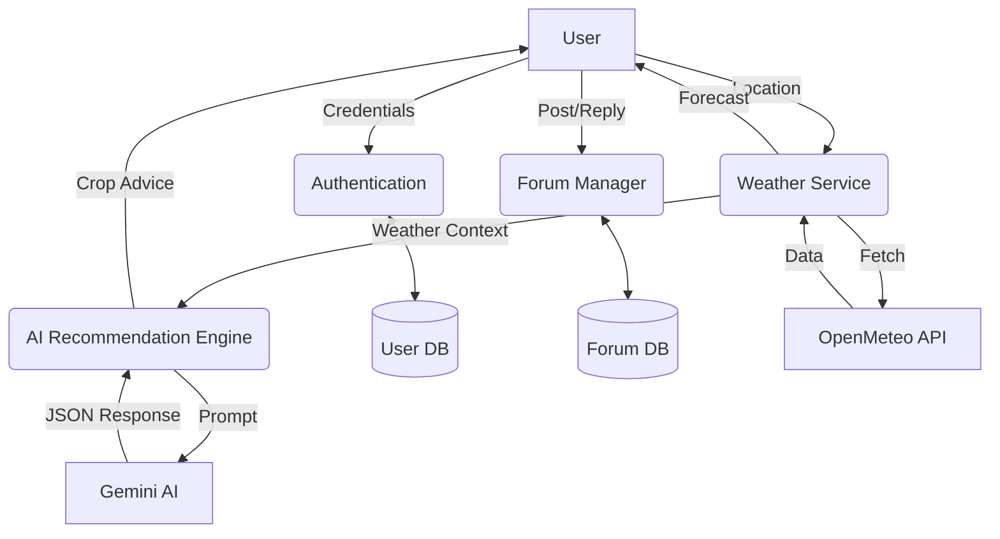
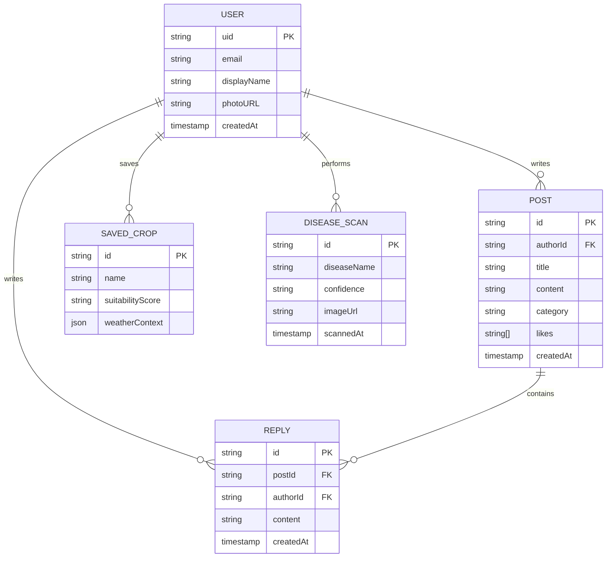

# CHAPTER THREE: SYSTEM ANALYSIS AND DESIGN

## 3.1 Introduction
The System Analysis and Design phase is a critical stage in the development of the **FarmersRain Planner (AgriCast)** application. This chapter details the comprehensive process of analyzing the needs of smallholder farmers in Zambia and designing a robust, AI-driven mobile solution to address their challenges. The primary objective of this system is to bridge the gap between traditional farming practices and modern climate-smart agriculture by leveraging Artificial Intelligence (AI), hyperlocal weather data, and community-driven knowledge sharing.

The analysis focuses on understanding the limitations of current agricultural advisory methods—such as generalized radio forecasts and scarce extension services—and defining the requirements for a mobile application that is accessible, offline-capable, and culturally relevant. The design section outlines the architectural blueprint, including the integration of **React Native** for cross-platform mobile access, **Google Gemini AI** for intelligent crop recommendations, **OpenMeteo** for precision weather forecasting, and **Firebase** for scalable backend services. This chapter serves as the foundational roadmap that guided the implementation of the AgriCast ecosystem.

## 3.2 Requirement Methods
To ensure the system effectively meets the needs of its target users, a rigorous requirement gathering process was undertaken.

### 3.2.1 Stakeholder Interviews
Direct engagement with key stakeholders was conducted to gain qualitative insights into the agricultural landscape.
- **Smallholder Farmers**: Interviews focused on their daily decision-making processes, reliance on rain-fed agriculture, and specific pain points regarding weather unpredictability. Key findings revealed a desperate need for "village-level" weather accuracy rather than district-level forecasts.
- **Agricultural Extension Officers**: Discussions highlighted the challenge of reaching remote farmers. Officers emphasized the need for a tool that could serve as a "digital assistant" to supplement their physical visits.
- **Agronomists**: Consultations provided the scientific basis for the crop recommendation engine, defining the parameters (temperature, rainfall, soil type) required to map crops to weather patterns.

### 3.2.2 Surveys and Questionnaires
Quantitative data was collected through structured surveys distributed to farming cooperatives.
- **Digital Literacy**: The surveys assessed smartphone penetration and digital literacy levels, confirming that while many farmers own smartphones, the interface must be visual and intuitive.
- **Information Needs**: Farmers ranked their information needs, with "Rainfall Start Dates," "Pest Identification," and "Market Prices" emerging as the top three priorities.
- **Connectivity**: Data on internet reliability indicated that a significant portion of the target audience operates in areas with intermittent 3G/4G coverage, necessitating an "Offline-First" architecture.

### 3.2.3 Use Case Analysis
The system functionality was modeled through Use Case Analysis to define interactions between actors and the system.

**Primary Actors:**
1.  **Farmer (User)**: The end-user who seeks weather data, crop advice, and community support.
2.  **System (AI/Backend)**: The automated entity processing data and generating recommendations.

**Key Use Cases:**
-   **View Hyperlocal Weather**: The Farmer requests weather for their specific GPS location; the System retrieves and displays 7-day and hourly forecasts.
-   **Get Crop Recommendations**: The Farmer requests planting advice; the System analyzes the weather forecast using Gemini AI and returns suitable crop suggestions with suitability scores.
-   **Identify Crop Disease**: The Farmer uploads a photo of a sick plant; the System (Gemini Vision) analyzes the image and provides a diagnosis and treatment plan.
-   **Participate in Forum**: The Farmer posts a question or replies to a discussion; the System updates the Firestore database and notifies relevant users.
-   **Access Offline Data**: The Farmer opens the app without internet; the System retrieves cached weather and crop data from local storage.

## 3.3 System Development Methodology
The project adopted an **Agile Development Methodology**, specifically utilizing an iterative and incremental approach. This methodology was chosen to allow for continuous feedback and adaptation, which is crucial when developing for a user base with specific and evolving needs.

-   **Iterative Cycles (Sprints)**: Development was broken down into two-week sprints.
    -   *Sprint 1*: Core Weather Dashboard and Location Services.
    -   *Sprint 2*: AI Crop Recommendation Engine.
    -   *Sprint 3*: Community Forum and Authentication.
    -   *Sprint 4*: Agricultural Tools (Disease ID, Soil Health) and Offline Optimization.
-   **Prototyping**: Low-fidelity wireframes were created first, followed by high-fidelity interactive prototypes in the actual app environment. This allowed for early testing of the "Crop Card" designs and navigation flow.
-   **User Feedback Loop**: Each iteration was tested with a small group of users to validate features like the "Suitability Score" visualization, ensuring the AI outputs were understandable to non-technical users.

## 3.4 Requirements Gathering and Analysis
Following the methodology, the specific requirements were crystallized. The analysis phase highlighted that a generic weather app would be insufficient. The system needed to be an **"Agricultural Decision Support System"** rather than just a forecast tool.

**Key Analysis Findings:**
1.  **Contextualization is Key**: Weather data alone is useless without agricultural context. Knowing it will rain 50mm is less valuable than knowing "50mm of rain is good for Maize but bad for drying Groundnuts."
2.  **Trust through Community**: Farmers trust peer validation. The system required a social component (Forum) where AI advice could be discussed and validated by experienced community members.
3.  **Visual Diagnosis**: Text-based descriptions of pests are often misunderstood. An image-based diagnosis tool was identified as a critical requirement to accurately identify crop diseases.

## 3.5 Program Design, Database Design, Interface Design

This section describes the detailed program design (software architecture and module breakdown), the database design tailored for Cloud Firestore, and the interface design principles used to make AgriCast usable for smallholder farmers.

### 3.5.1 Program Design (Software Architecture)

- **High-level architecture**: AgriCast follows a modular, client-centric architecture composed of:
    - **Presentation Layer (React Native / Expo)**: UI components, navigation, and local state management. Key folders: `screens/`, `components/`, `navigation/`.
    - **Domain / Business Logic Layer**: Services that encapsulate core functionality (e.g., `services/cropService.ts`, `weather/api.ts`, `services/forumService.ts`). This layer prepares data for AI prompts, handles caching, and enforces business rules.
    - **Data Layer**: Integrations with external systems (OpenMeteo, Gemini AI) and Firebase for persistence. This layer exposes small, well-typed interfaces for the upper layers.

- **Module responsibilities**:
    - **Auth Module** (`contexts/AuthContext.tsx`, `config/firebase.ts`): Manages sign-in/up, session persistence, and user metadata.
    - **Weather Module** (`weather/api.ts`): Fetches and normalizes OpenMeteo data, provides helper functions to compute averages and human-readable summaries.
    - **Crop Recommendation Module** (`services/cropService.ts`): Analyzes weather, constructs AI prompts, parses AI responses, and provides caching and fallback quick-recommendations.
    - **Tools Module** (`components/tools/*` and `services/savedIdentifications.ts`): Implements image capture, preprocessing, and calls to Gemini Vision for disease detection.
    - **Forum Module** (`services/forumService.ts`): CRUD operations for posts & replies and real-time listeners.

- **Error handling and resilience**: Each external call is wrapped with retries, timeouts, and user-friendly fallbacks (e.g., show cached data with a warning banner). The app uses feature flags and graceful degradation when AI or third-party services are unavailable.

- **Testing strategy by layer**:
    - Unit tests for pure functions and utilities (Jest).
    - Integration tests for service-to-API interactions (mocked network responses).
    - End-to-end flows using device/emulator runs for critical user journeys.

### 3.5.2 Database Design (Cloud Firestore)

Although Firestore is schemaless, the app enforces logical schemas through TypeScript types and controlled write paths. The recommended top-level collections and document structures are:

- **users (collection)**
    - docId: `uid`
    - fields: `email`, `displayName`, `photoURL`, `farmInfo` (embedded object: `size`, `mainCrops`, `location`), `savedCrops` (array or subcollection), `createdAt`, `preferences`

- **posts (collection)**
    - docId: auto-generated
    - fields: `authorId`, `authorName`, `title`, `content`, `category`, `topic`, `likes` (array of userIds), `likeCount`, `replyCount`, `createdAt`, `updatedAt`
    - replies stored in a `replies` collection with `postId` FK or as a subcollection under each post depending on read/write patterns.

- **replies (collection)** (or `posts/{postId}/replies` subcollection)
    - docId: auto
    - fields: `postId`, `authorId`, `authorName`, `content`, `createdAt`, `likes`, `likeCount`

- **diseaseScans (collection)** (or subcollection under `users/{uid}/diseaseScans`)
    - fields: `userId`, `imageUrl`, `diseaseName`, `confidence`, `severity`, `treatment`, `scannedAt`

- **cropRecommendations (cache collection)**
    - fields: `locationKey` (e.g., lat_lon rounded), `recommendations` (JSON), `generatedAt`, `expiresAt`

- **Indexes & security**:
    - Composite indexes for queries that filter posts by `category` and order by `createdAt`.
    - Firestore Security Rules to ensure users can only modify their own profile, posts/replies enforce ownership where required, and admin moderation privileges are controlled by custom claims.

- **Offline & sync considerations**:
    - Firestore SDK offers offline persistence for basic sync scenarios. For heavier offline-first behavior (weather and AI responses), the app also stores JSON blobs in `AsyncStorage` keyed by `location` and timestamp and uses a TTL to decide staleness.

### 3.5.3 Interface Design (UI / UX)

The interface design focuses on clarity, accessibility, and low-bandwidth usability for smallholder farmers.

- **Design principles**:
    - **Simplicity**: Minimal navigation (bottom tab bar) with primary tasks accessible in 1–2 taps.
    - **Visual-first**: Use of icons, color-coded badges (Green = Good, Yellow = Caution, Red = Risk), and large touch targets to aid low literacy users.
    - **Offline awareness**: Clear indicators when data is cached vs live; explicit "Refresh" affordances for users to fetch latest forecasts.
    - **Accessibility**: High-contrast colors, text scaling support, and descriptive accessibility labels for screen readers.

- **Key screens & UI components**:
    - **Home / Weather Dashboard**: Prominent location header, current condition tile, 7-day carousel, and hourly timeline. Secondary CTA: "Get Crop Advice".
    - **Crops Screen**: List of recommended crops (cards) with suitability score, short reasoning, and a "Details" button linking to full crop guide.
    - **Tools Screen**: Quick access tiles for Disease ID, Soil Checker, Market Prices. Disease ID shows camera/gallery CTA and recent scans.
    - **Forum**: Feed with category filters, large post cards, and a floating action button to create a new post.
    - **Profile**: Farm settings, saved items, and app settings (language, units, data usage).

- **Interaction patterns & feedback**:
    - **Optimistic UI**: For actions like liking a post or saving a crop, the UI updates immediately and reconciles with the backend in the background.
    - **Progress indicators**: Spinners or skeleton loaders while fetching AI recommendations or uploading images.
    - **Error messaging**: Plain-language messages with suggested actions (e.g., "No internet — showing saved data. Tap to retry.").

- **Localization & language**:
    - All user-facing strings are externalized (i18n-ready) to support English and local languages. Iconography and color cues reduce dependency on text alone.

### 3.5.4 Wireframes and Prototyping Notes

- Initial wireframes focused on large touch targets and linear flows: (1) detect location, (2) show weather, (3) show crop recommendations.
- Prototypes were validated with low-fidelity user testing; changes included larger fonts, clearer CTA labels, and simplified settings.

### 3.5.5 Summary — Design Rationale

The program, database, and interface designs are aligned to deliver an application that is resilient under intermittent connectivity, easy to use for low-literacy users, and maintainable by the development team. The modular program design isolates responsibilities for testing and reuse; the Firestore-based database design balances real-time requirements and offline caching; the interface design prioritizes visual clarity and accessibility to ensure the app delivers real impact for smallholder farmers.

## 3.6 REQUIREMENTS ENGINEERING
Based on the analysis, the system requirements were engineered into specific functional deliverables.

### 3.6.1 Functional Requirements
These define the specific behaviors and functions of the system:

1.  **User Authentication**:
    -   The system shall allow users to sign up and log in using email and password via Firebase Auth.
    -   The system shall support persistent sessions to avoid frequent logins.

2.  **Weather Forecasting**:
    -   The system shall automatically detect the user's GPS location.
    -   The system shall display current weather, hourly updates, and a 7-day forecast including temperature, rainfall, and wind speed.

3.  **AI Crop Recommendations**:
    -   The system shall analyze forecast data to generate a list of suitable crops.
    -   The system shall provide a "Suitability Score" (0-100%) and detailed reasoning for each recommendation.

4.  **Disease & Pest Identification**:
    -   The system shall allow users to capture or upload images of crops.
    -   The system shall use AI to identify diseases/pests and provide treatment options (organic and chemical).

5.  **Community Forum**:
    -   The system shall allow users to create posts, filter by category (e.g., Soil Health, Market), and reply to others.
    -   The system shall support "Liking" posts to highlight useful information.

6.  **Offline Functionality**:
    -   The system shall cache the latest weather and crop recommendations locally.
    -   The system shall allow users to view saved data without an internet connection.

## 3.7 Non-Functional Requirements
These define the quality attributes of the system:

1.  **Performance**:
    -   The application shall load the dashboard in under 3 seconds on a standard 4G connection.
    -   AI analysis for crop recommendations shall complete within 10 seconds.

2.  **Reliability & Availability**:
    -   The system shall rely on Firebase's 99.9% uptime SLA.
    -   Weather data shall be updated every hour to ensure accuracy.

3.  **Usability**:
    -   The UI shall use high-contrast colors and intuitive icons to accommodate users with lower digital literacy.
    -   Navigation shall be restricted to a simple bottom tab bar for ease of access.

4.  **Scalability**:
    -   The backend shall support horizontal scaling to handle thousands of concurrent users during the planting season.

5.  **Security**:
    -   User passwords shall be hashed and salted (handled by Firebase).
    -   API keys for Gemini and Weather services shall be secured using environment variables.

## 3.8 Software Tools for System Design and Development
The following tools and technologies were selected to implement the design:

| Category | Tool/Technology | Purpose |
| :--- | :--- | :--- |
| **Frontend Framework** | **React Native (Expo)** | Chosen for its ability to build native Android and iOS apps from a single JavaScript/TypeScript codebase, accelerating development. |
| **Programming Language** | **TypeScript** | Used to ensure code quality, type safety, and maintainability across the large codebase. |
| **Backend / Database** | **Firebase (Google)** | **Authentication** for user management and **Cloud Firestore** for a flexible, real-time NoSQL database to store forum posts and user profiles. |
| **Artificial Intelligence** | **Google Gemini API** | The core intelligence engine used for analyzing weather patterns to recommend crops (`gemini-pro`) and analyzing images for disease detection (`gemini-pro-vision`). |
| **Weather Data Provider** | **OpenMeteo API** | Selected for its high-precision, free-tier access to global weather models without requiring an API key for basic usage. |
| **UI Styling** | **NativeWind (Tailwind CSS)** | Used for rapid UI development, ensuring a consistent and responsive design system. |
| **IDE** | **Visual Studio Code** | The primary development environment, utilized for its robust extension ecosystem and TypeScript support. |
| **Version Control** | **Git & GitHub** | Used for source code management, tracking changes, and facilitating collaboration. |

## 3.9 Data and Process Modelling Diagrams
This section presents the visual models used to define the system's requirements, data structures, and process flows.

### 3.9.1 Use Case Diagram
The Use Case Diagram visualizes the interactions between the primary actors (Farmers) and the system's core functionalities. It illustrates the scope of the AgriCast application and how users engage with its various modules.

**Actors:**
*   **Farmer**: The primary user who interacts with the application to access weather data, crop advice, and community features.
*   **Authentication System (Firebase)**: Handles user identity verification.
*   **AI Engine (Gemini)**: Processes weather data for recommendations and images for disease diagnosis.
*   **Weather Service (OpenMeteo)**: Provides real-time and forecast weather data.

**Diagram:**
```mermaid
usecaseDiagram
    actor "Farmer" as F
    actor "Firebase Auth" as Auth
    actor "OpenMeteo API" as Weather
    actor "Gemini AI" as AI

    package "AgriCast System" {
        usecase "Sign Up / Login" as UC1
        usecase "View Weather Forecast" as UC2
        usecase "Get Crop Recommendations" as UC3
        usecase "Identify Crop Disease" as UC4
        usecase "Post to Community Forum" as UC5
        usecase "View Offline Data" as UC6
    }

    F --> UC1
    F --> UC2
    F --> UC3
    F --> UC4
    F --> UC5
    F --> UC6

    UC1 ..> Auth : Verify Identity
    UC2 ..> Weather : Fetch Data
    UC3 ..> Weather : Get Context
    UC3 ..> AI : Analyze & Recommend
    UC4 ..> AI : Analyze Image
```

### 3.9.2 Sequence Diagram
The Sequence Diagram details the chronological flow of messages for the system's most complex feature: **Generating AI Crop Recommendations**.

**Scenario: Getting Crop Recommendations**


### 3.9.3 Data Flow Diagrams (DFD)
The Data Flow Diagram illustrates how data moves through the AgriCast system, from external entities to processes and data stores.

**Level 0 DFD (Context Diagram)**
The context diagram shows the system as a single process interacting with external entities.


**Level 1 DFD (Process Breakdown)**
This diagram breaks down the main system into sub-processes: Authentication, Weather Service, Recommendation Engine, and Forum Manager.


### 3.9.4 Entity Relationship Diagram (ERD)
The Entity Relationship Diagram (ERD) models the data structure of the application. Since AgriCast uses **Cloud Firestore** (a NoSQL database), the data is structured in documents and collections rather than traditional relational tables.

**Data Entities:**
1.  **Users**: Stores profile information, preferences, and saved items.
2.  **Posts**: Represents community forum discussions.
3.  **Replies**: Represents responses to forum posts.
4.  **SavedCrops**: Stores crop recommendations saved by the user.
5.  **DiseaseIdentifications**: Stores history of disease scans.

**Diagram:**


## 3.13 Chapter Summary

This chapter has provided a comprehensive analysis and design blueprint for the **FarmersRain Planner (AgriCast)** system. 

We began by establishing the **requirements**, driven by direct engagement with Zambian smallholder farmers, identifying the critical need for hyperlocal weather accuracy and accessible advisory services. The **analysis** confirmed that the proposed solution is technically achievable using React Native and Firebase, and economically viable given the low cost of the selected APIs.

The **system design** was detailed through various modeling techniques:
*   **Use Case Diagrams** clarified the scope of user interactions, focusing on weather monitoring, crop planning, and community engagement.
*   **Entity Relationship Diagrams (ERD)** defined the NoSQL data structure required to support user profiles, forum discussions, and saved agricultural data.
*   **Data Flow Diagrams (DFD)** illustrated the movement of information between the user, the system, and external services like OpenMeteo and Gemini AI.
*   **Sequence Diagrams** mapped out the complex logic flow of the AI recommendation engine, ensuring a clear understanding of the dependency on real-time weather data.

Collectively, this analysis and design phase lays a solid foundation for the implementation phase, ensuring that the final product is robust, scalable, and directly aligned with the needs of the agricultural community it serves.

